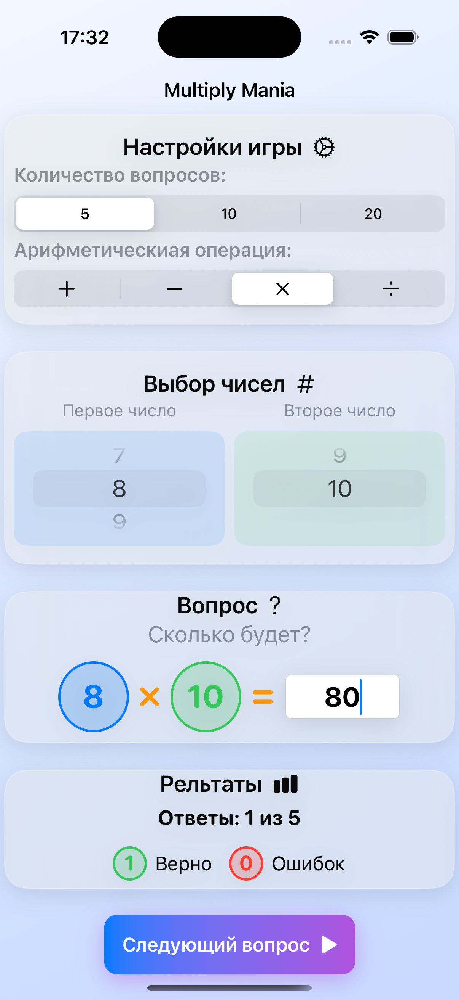

# Игра "Мания умножения"

Игра для тренировки навыков счета с использованием SwiftUI. Позволяет практиковать основные арифметические операции с гибкими настройками сложности.


## Особенности

### 🌈 Интерфейс
- Эффект стеклянного морфизма с градиентным фоном
- Современный дизайн с плавными анимациями
- Адаптивный под разные размеры экранов

### ⚙️ Настройки
- **Количество вопросов**: 5, 10 или 20
- **Арифметические операции**: 
  - Сложение (+)
  - Вычитание (-) 
  - Умножение (×)
  - Деление (÷)
- **Диапазон чисел**: от 1 до 10

### 🎮 Игровой процесс
- Интерактивный ввод ответов
- Мгновенная проверка результатов
- Умная клавиатура:
  - Поддержка отрицательных чисел
  - Только цифровой ввод
  - Автопроверка на ошибки

### 📊 Статистика
- Наглядное отображение прогресса
- Счетчик правильных ответов
- Количество ошибок
- Визуализация результатов

### 💡 Дополнительно
- Подсказки при ошибках
- Подробные объяснения
- Возможность начать заново

## Технические требования
- iOS 16+
- Xcode 14+
- Swift 5.7+

## Установка
1. Клонируйте репозиторий:
```bash
git clone https://github.com/Serge-17/MultiplyMania.git
```

## 👨‍💻 Автор

**Serge Eliseev**
- GitHub: [@Serge-17](https://github.com/Serge-17)
